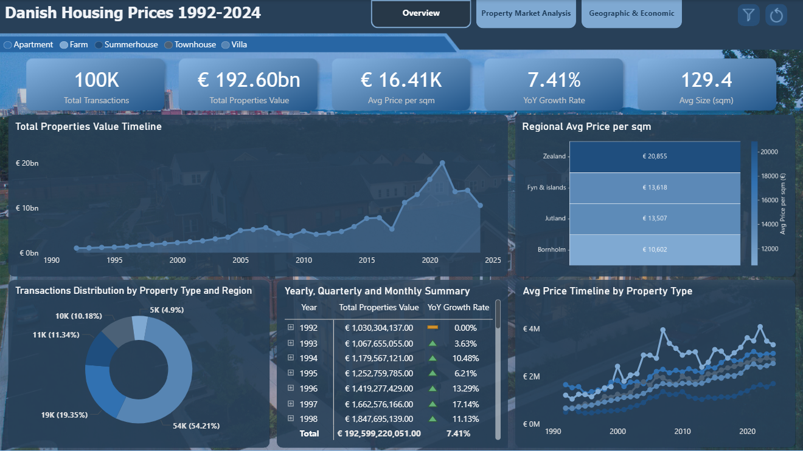
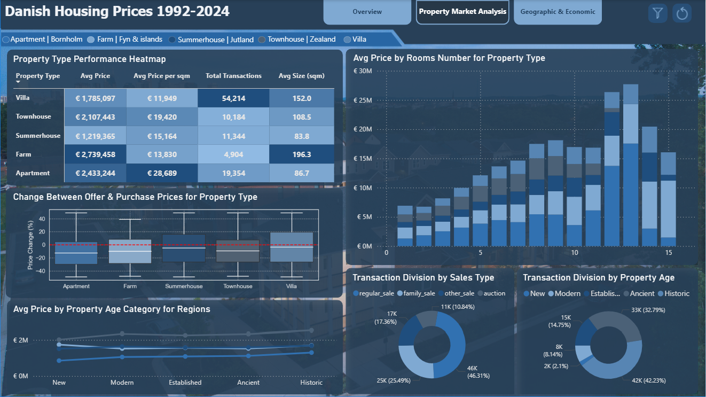
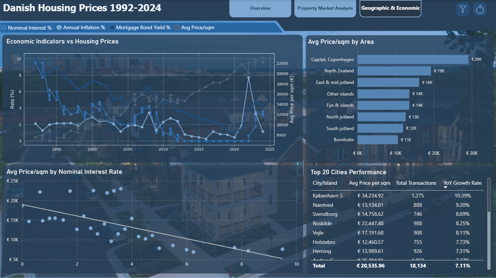

# Danish Housing Prices Analysis (1992-2024)

This project analyzes **33 years of Danish Housing Prices from 1992 to 2024**. The analysis detects trends and insights through an overview, market analysis, and geographical & economical analysis to provide a comprehensive view of the Danish residential property market.

---

## Business Task

**Develop an interactive Power BI report** to analyze the Danish residential housing market from 1992 to 2024. The goal is to identify key trends, price fluctuations, and geographical and economic factors influencing housing prices to support informed decision-making for stakeholders, investors, and policymakers.

---

## Tools Used

- **Python:** For initial data cleaning and transformation.

- **BigQuery:** As the data storage and connection.

- **Power Query:** For data modeling (star schema) and further transformation.

- **Power BI:** For building DAX measures and developing interactive dashboards.

- **Git & GitHub:** For version control and project documentation.

---

## Project Structure

| Folder        | Description                                 |
|---------------|---------------------------------------------|
| `notebooks/`  | Jupyter Notebook for data cleaning & transformation      |
| `powerbi/`    | Power BI `.pbix` file and dashboard screenshot           |
| `data/`       | Sample data file (`.csv`) for demonstration and Metadata |
| `README.md`   | Project overview, insights, and recommendations          |
| `LICENSE`     | MIT License file (permissions & usage)                   |

---

## Data Source

- **Time Period:** January 1992, to October 2024
- **Source:** The data used in this analysis was taken from [MartinSamFred/Danish-residential-housingPrices-1992-2024](https://github.com/MartinSamFred/Danish-residential-housingPrices-1992-2024/tree/main/Housing_data_cleaned)
- **Connection:** Dataset uploaded to **BigQuery** and connected to **Power BI**

---

## Data Cleaning & Modeling

Since the volume of data was large, **Python** was used for initial cleaning:

- Handled columns with null values by replacing them with exact values.
- Checked for duplicated values.

After cleaning, the data was uploaded to BigQuery and connected to Power BI, where further modeling was performed:

- Removed unused columns.
- Corrected column data types.
- Built a **star schema data model** with five tables using Power Query.
- Created a dimensional table for date using **advanced editor**.
- Created calculated columns for some tables.

---

## Dashboards & Visualization

### Defined DAX measures for key metrics.

The Power BI report is presented through **three main interactive dashboards**:

### 1. Overview Dashboard
This dashboard provides a high-level summary of the Danish housing market's performance over the 33-year period.

**Key Visuals & Metrics:**

- **KPI Cards:** Total Transactions, Total Properties Value, Average Price per sqm, YoY Growth Rate, and Regional Average Size (sqm).
- **Total Properties Value Timeline:** Shows the trend of total properties value over time and drill down to months for each year.
- **Regional Avg Price per sqm:** Heatmap compares average price per square meter across regions.
- **Transactions Distribution by Property Type and Region:** Visualizes the breakdown of transactions by property type (Apartment, Farm, Summerhouse, Townhouse, Villa) and drill down to beakdown property by region.
- **Yearly, Quarterly, and Monthly Summary:** Detailed matrix showing properties value and growth rates over Years, Quarters, and Months.
- **Avg Price Timeline by Property Type:** Compares the property average price trend for different property types overtime.

**Dashboard Preview:**

### 2. Property Market Analysis Dashboard
This dashboard focuses on the performance and dynamics of the property market, including price changes and transaction volumes by property age, and sales type.

**Key Visuals & Metrics:**

- **Property Type Performance Heatmap:** Compares property average price, average price per sqm, total transactions, and average size (sqm) across all property types.
- **Avg Price by Rooms Number for Property Type:** Visualizes property average price based on the number of rooms for each property type.
- **Change Between Offer & Purchase Prices for Property Type:** Analyzes the difference between the initial offer and the final purchase price for all property types.
- **Avg Price by Property Age Category for Regions:** Shows how property average price varies based on the age of the property (New, Modern, Established, Ancient, Historic) across different regions.
- **Transaction Division by Sales Type:** Breaks down transactions by sales type (Regular_Sale, Family_Sale, Other_Sale, Auction).
- **Transaction Division by Property Age Category:** Shows the distribution of transactions across property age categories (New: 0-5 years, Modern: 6-20 years, Established: 21-50 years, Ancient: 51-100 years, Historic: 100+ years).

**Dashboard Preview:**

### 3. Geographic & Economic Analysis Dashboard
This dashboard explores the influence of geographical location and macroeconomic factors on housing prices.

**Key Visuals & Metrics:**

- **Economic Indicators vs Housing Prices:** A line chart comparing key economic indicators (Nominal Interest %, Annual Inflation %, Mortgage Bond Yield %) against the Average Price per sqm over time.
- **Avg Price/sqm by Area:** A bar chart comparing the average price per square meter across different geographical areas (e.g., Capital, North Zealand, East Jutland).
- **Avg Price/sqm by Nominal Interest Rate:** A scatter plot showing the relationship between the average price per square meter and the nominal interest rate.
- **Top 10 Cities Performance:** A table detailing the performance of the top 20 cities based on Avg Price per sqm, Total Transactions, and YoY Growth Rate filtered by top total transactions.

**Dashboard Preview:**

### Filter Panel
A comprehensive filter panel is added to each page for interactive data exploration and personalized insights.

*Power BI file:* [Denmark Housing Prices](powerbi) or [Download from Google Drive](https://drive.google.com/file/d/1OrCPiFMAGg5YR-LZi9dB4ifF7WZWmufr/view?usp=sharing)

---

## Key Insights and Recommendations

### Key Insights

- **Strong Market Growth:** The Danish housing market has shown significant growth over the 33-year period, with a **Total Value of €192.60 billion** and a **Year-over-Year Growth Rate of 7.41%**.
- **Property Type Performance:** **Villas** Likely show highest absolute prices but **apartments** highest price/sqm.
- **Property Age in Demand:** **Historic** Properties that built 100+ years ago have the highest valume of transactions with **42 thousand** of total transactions.
- **Area Price Disparity:** There is a clear disparity in housing prices, with the **Capital Copenhagen** and **North Zealand** commanding the highest average prices per square meter, indicating strong demand in these areas.
- **Economic Influence:** Housing prices show a correlation with economic indicators. Specifically, the **Average Price per sqm** tends to move inversely with the **Nominal Interest Rate**, suggesting that lower interest rates contribute in price increases.
- **Top Performing Cities:** Cities like **København S**, **Næstved**, and **Svendborg** show the highest YoY growth rates, and cities like **København S**, **Horsens**, and **Alborg** show the highest transaction valume making them attractive areas for investment.

### Recommendations

- **For Investors:** Focus on high-growth cities like **København S** and **Næstved** with high transaction cities like **København S** and **Horsens** for potential capital appreciation. Monitor the **Nominal Interest Rate** as a key indicator for market entry/exit timing.
- **For Policymakers:** The strong regional price disparity suggests a need for policies to address housing affordability in high-demand areas like the **Zealand** region.
- **For Buyers:** Analyze the **Change Between Offer & Purchase Prices** to understand negotiation room in different property types and regions. Consider properties in areas with moderate prices but strong growth, such as **Næstved**, or **Svendborg**.

---

## License

This project is licensed under the [MIT License](LICENSE)

---

## Author

**Aymen Mohammed** — Data Analyst passionate about using data to tell stories and drive business decisions.

 
 
 

